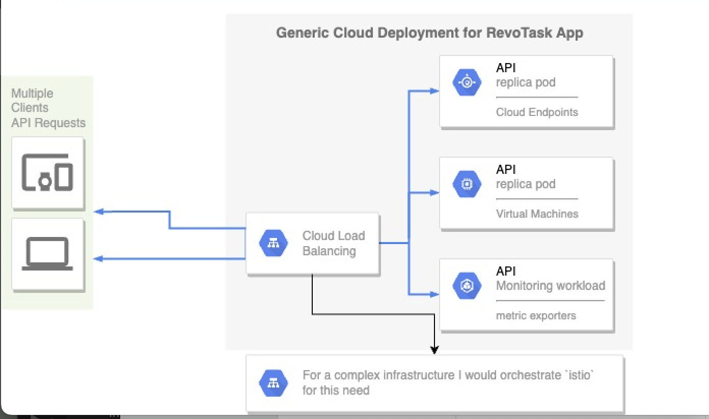

# RevoTask

RevoTask is a tiny python based API solution for greeting a user based on their number of days to their birthday.

## Deployable on almost any cloud environment



## How it works
- A user posts their username with a payload of their birthdate.
- Based on their birthdate provided, the user is greated with "hello your birthdate is in N days"
- in the case where the birthdate is on the current day, the user is greated with "hello, happy birthday!"

## GitHub Repository
The GitHub repository holding the main implementation of this tool and its infrastructure configuration is available at [RevTask](https://github.com/sonlinux/revotask.git)


## Setting Up Local Development Environment
the quickest way to do this would be using [docker](https://docs.docker.com/get-started/) and [docker-compose](https://docs.docker.com/compose/). with these 2 setup, you can proceed to the following steps below.


clone the git repository

```bash
git clone https://github.com/sonlinux/revotask.git
```

change path into the project directory

```bash
cd revotask
```

Spin up the docker developer container (this has live code reload during development): 

```bash
$ docker-compose up --build
```

- To read the API browsable documentation, open the browser at 

```bash
http://localhost:8000
```

and

- To interact with the API endpoints in the browser, open 

```bash
http://localhost:8000/docs
```

## Production deployment

When you are ready to deploy to production environment you need the following tools to be installed

- Kubernetes engine
- kubectl for interacting with the kubernetes cluster
- Helm for templating deployment environment
- Make for easy command option interaction

Firstly you will need a running kubernetes cluster and ensuring that you have access to it via kubectl.

- Create a namespace called api in using `kubectl` within your kubernetes cluster
```bash
kubectl create namespace api
```

- Build the docker image that the helm chart is expecting to use

```bash
make build
```

- Update the helm chart manifest to ensure its pointing to the most recent updates

```bash
make render
```

- Deploy the workload to your cluster namespace below
```bash
make deploy
```

At this point you should have your kubernetes pod running and your service accessible in the browser at `http://localhost:8000`
Congratulations!